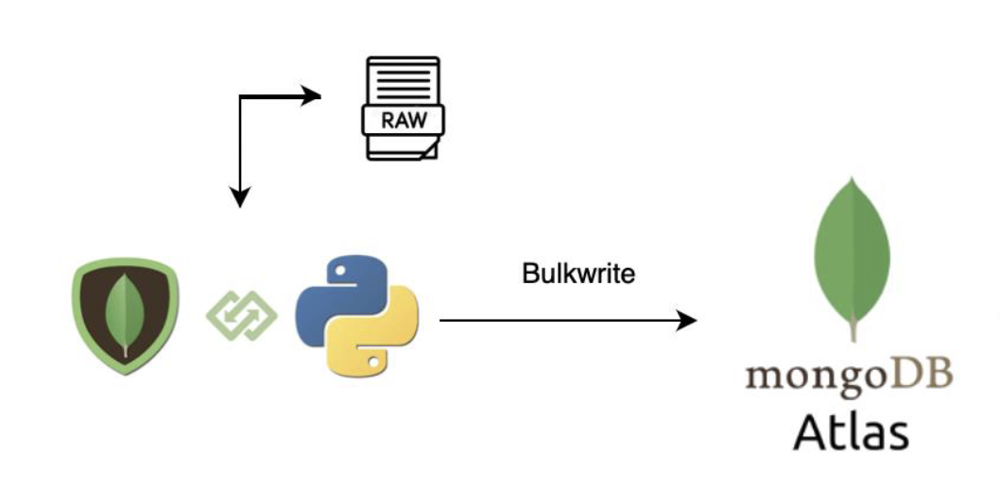

# Laboratorio No. 4

## Descripción
Se implementa la arquitectura utilizando librerías que implementan MongoDB.


## Uso
1. Asegúrate de tener MongoDB instalado y en ejecución en tu máquina.
2. Clona este repositorio y navega a la carpeta del proyecto.
3. Instala las dependencias necesarias utilizando pip:
    ```
    pip install python-dotenv  
    pip install pymongo 
    pip install "pymongo[srv]"
    ```
4. Crea un archivo `.env` en la raíz del proyecto y agrega tu URI de MongoDB, el nombre de la base de datos y el nombre de la colección:
    ```
    MONGODB_URI=tu_uri_de_mongodb
    MONGODB_DATABASE=nombre_de_tu_base_de_datos
    COLLECTION_NAME=nombre_de_tu_coleccion
    ```
5. Ejecuta el script `mongo.py` y proporciona la ruta al archivo CSV cuando se te solicite:
    ```
    python mongo.py


    Ingresa la ruta del archivo CSV: data/McDonalds.csv
    ```

## Funcionalidades
- El script lee un archivo CSV y lo convierte en una lista de diccionarios.
- Crea documentos embebidos a partir de los datos del CSV.
- Sube los datos a MongoDB utilizando operaciones de escritura en bloque (bulk write).
- Imprime el resultado de la operación de subida a MongoDB, incluyendo la cantidad de documentos.